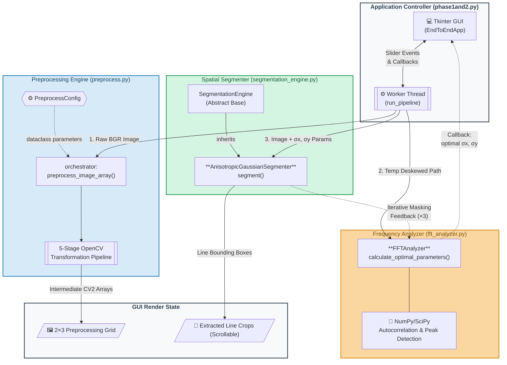

```mermaid
flowchart TD
    %% ==========================================
    %% NODE STYLING & THEMES
    %% ==========================================
    classDef module fill:#F8F9FA,stroke:#2C3E50,stroke-width:2px,color:#2C3E50,font-weight:bold
    classDef engine fill:#D6EAF8,stroke:#2980B9,stroke-width:2px,color:#154360
    classDef analyzer fill:#FAD7A0,stroke:#D68910,stroke-width:2px,color:#7E5109
    classDef segmenter fill:#D5F5E3,stroke:#229954,stroke-width:2px,color:#145A32
    
    %% ==========================================
    %% LAYER 1: APPLICATION CONTROLLER (TOP)
    %% ==========================================
    subgraph L1 ["Application Controller (phase1and2.py)"]
        direction LR
        UI["💻 Tkinter GUI\n(EndToEndApp)"]
        WORKER[["⚙️ Worker Thread\n(run_pipeline)"]]
        UI <-->|"Slider Events\n& Callbacks"| WORKER
    end

    %% ==========================================
    %% LAYER 2: BUSINESS LOGIC ENGINES (MIDDLE)
    %% ==========================================
    subgraph L2_PRE ["Preprocessing Engine (preprocess.py)"]
        direction TB
        CFG{{"⚙️ PreprocessConfig"}}
        ORCH["orchestrator:\npreprocess_image_array()"]
        PIPE[["5-Stage OpenCV\nTransformation Pipeline"]]
        CFG -.->|"dataclass parameters"| ORCH
        ORCH --> PIPE
    end

    subgraph L2_FFT ["Frequency Analyzer (fft_analyzer.py)"]
        direction TB
        ACF["**FFTAnalyzer**\ncalculate_optimal_parameters()"]
        SIG["📶 NumPy/SciPy\nAutocorrelation & Peak Detection"]
        ACF --- SIG
    end

    subgraph L2_SEG ["Spatial Segmenter (segmentation_engine.py)"]
        direction TB
        BASE["SegmentationEngine\n(Abstract Base)"]
        ANISO["**AnisotropicGaussianSegmenter**\nsegment()"]
        BASE -->|"inherits"| ANISO
    end

    %% ==========================================
    %% LAYER 3: RENDER STATE (BOTTOM)
    %% ==========================================
    subgraph L3 ["GUI Render State"]
        direction LR
        GRID[/"🖼️ 2×3 Preprocessing Grid"/]
        CROPS[/"📜 Extracted Line Crops (Scrollable)"/]
    end

    %% ==========================================
    %% INTER-MODULE DATA FLOW ROUTING
    %% ==========================================
    
    %% Execution Order from Worker
    WORKER -->|"1. Raw BGR Image"| ORCH
    WORKER -->|"2. Temp Deskewed Path"| ACF
    WORKER -->|"3. Image + σx, σy Params"| ANISO
    
    %% Feedback & Callbacks
    ACF -.->|"Callback:\noptimal σx, σy"| UI
    ANISO -.->|"Iterative Masking\nFeedback (×3)"| ACF
    
    %% Output to UI State
    PIPE -->|"Intermediate CV2 Arrays"| GRID
    ANISO -->|"Line Bounding Boxes"| CROPS

    %% Apply Styles
    class L1,L3 module
    class L2_PRE engine
    class L2_FFT analyzer
    class L2_SEG segmenter
```
