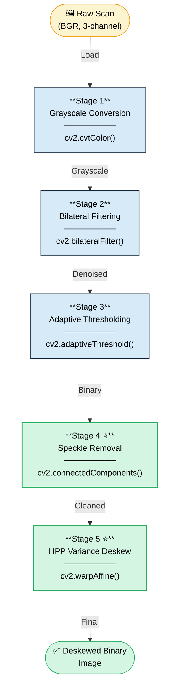

```mermaid
flowchart TD
    classDef default fill:#fff,stroke:#333,stroke-width:1px;
    classDef hidden fill:none,stroke:none;
    
    IN(["🖼️ Raw Scan\n(BGR, 3-channel)"])
    OUT(["✅ Deskewed Binary\nImage"])

    subgraph TopRow [" "]
        direction LR
        S1["**Stage 1**\nGrayscale Conversion\n─────────\ncv2.cvtColor()"] -->|"Grayscale"| S2["**Stage 2**\nBilateral Filtering\n─────────\ncv2.bilateralFilter()"]
        S2 -->|"Denoised"| S3["**Stage 3**\nAdaptive Thresholding\n─────────\ncv2.adaptiveThreshold()"]
    end

    subgraph BotRow [" "]
        direction RL
        S4["**Stage 4 ⭐**\nSpeckle Removal\n─────────\ncv2.connectedComponents()"] -->|"Cleaned"| S5["**Stage 5 ⭐**\nHPP Variance Deskew\n─────────\ncv2.warpAffine()"]
    end

    IN -->|"Load"| S1
    S3 -->|"Binary"| S4
    S5 -->|"Final"| OUT

    class TopRow,BotRow hidden

    style S1 fill:#D6EAF8,stroke:#2C3E50,color:#000
    style S2 fill:#D6EAF8,stroke:#2C3E50,color:#000
    style S3 fill:#D6EAF8,stroke:#2C3E50,color:#000
    style S4 fill:#D5F5E3,stroke:#27AE60,stroke-width:2px,color:#000
    style S5 fill:#D5F5E3,stroke:#27AE60,stroke-width:2px,color:#000
    style IN fill:#FCF3CF,stroke:#F39C12,color:#000
    style OUT fill:#D5F5E3,stroke:#27AE60,color:#000
```
