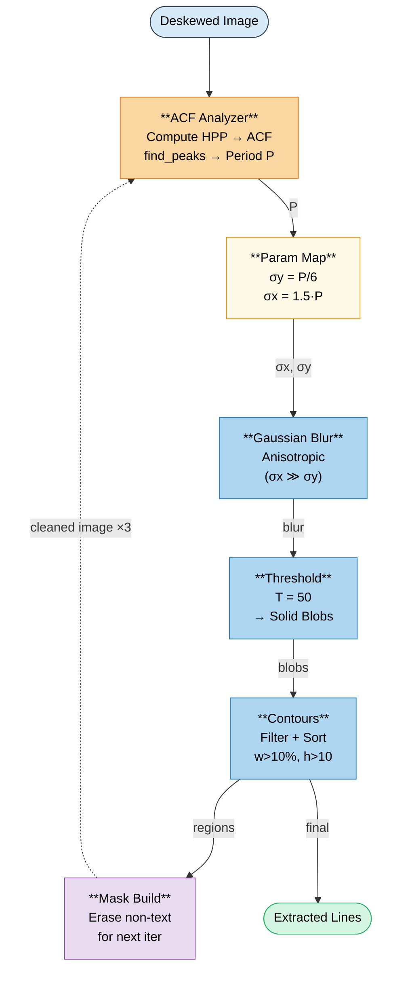

```mermaid
flowchart TD
    classDef hidden fill:none,stroke:none;

    IN(["Deskewed Image"])

    subgraph TopRow [" "]
        direction LR
        A["**ACF Analyzer**\nCompute HPP → ACF\nfind_peaks → Period P"] -->|"P"| B["**Param Map**\nσy = P/6\nσx = 1.5·P"]
    end

    subgraph MidRow [" "]
        direction RL
        C["**Gaussian Blur**\nAnisotropic\n(σx ≫ σy)"] -->|"blur"| D["**Threshold**\nT = 50\n→ Solid Blobs"] -->|"blobs"| E["**Contours**\nFilter + Sort\nw>10%, h>10"]
    end

    subgraph BotRow [" "]
        direction LR
        F["**Mask Build**\nErase non-text\nfor next iter"]
        OUT(["Extracted Lines"])
    end

    IN --> A
    B -->|"σx, σy"| C
    E -->|"regions"| F
    E -->|"final"| OUT
    F -.->|"cleaned image ×3"| A

    class TopRow,MidRow,BotRow hidden

    style IN fill:#D6EAF8,stroke:#2C3E50,color:#000
    style OUT fill:#D5F5E3,stroke:#27AE60,color:#000
    style A fill:#FAD7A0,stroke:#E67E22,color:#000
    style B fill:#FEF9E7,stroke:#F39C12,color:#000
    style C fill:#AED6F1,stroke:#2980B9,color:#000
    style D fill:#AED6F1,stroke:#2980B9,color:#000
    style E fill:#AED6F1,stroke:#2980B9,color:#000
    style F fill:#E8DAEF,stroke:#8E44AD,color:#000
```
